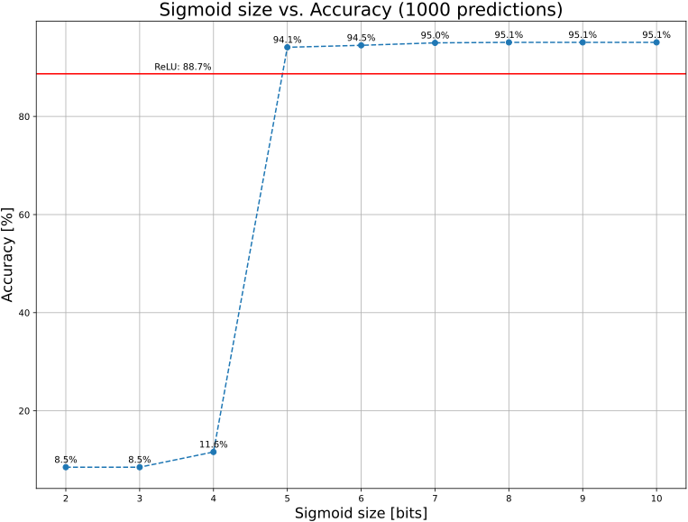

Fork of ZyNet (Based on work done here https://github.com/vipinkmenon/neuralNetwork) intended to be more modular and contain VHDL ports of Neuron models .

## Adjust weights, activation function etc.
Use the `mnistZyNet.py` script

```shell
$ python mnistZyNet.py --help
```


## Example performance
Sigmoid size is the width in bits of the values in the LUT for the sigmoid function, meaning how many steps the sigmoid function is divided into. More bits means smaller steps, means smaller disparity between the discretized value and the actual value of the function.

| Sigmoid Size [bits] | 2   | 3   | 4    | 5    | 6    | 7   | 8    | 9    | 10   |
| ------------------- | --- | --- | ---- | ---- | ---- | --- | ---- | ---- | ---- |
| Accuracy [%]        | 8.5 | 8.5 | 11.6 | 94.1 | 94.5 | 95  | 95.1 | 95.1 | 95.1 |

